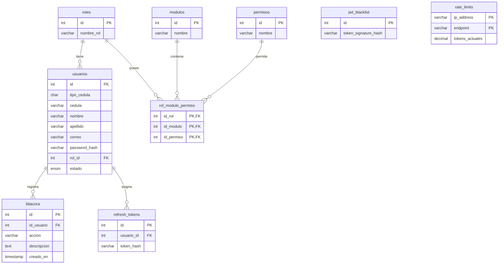
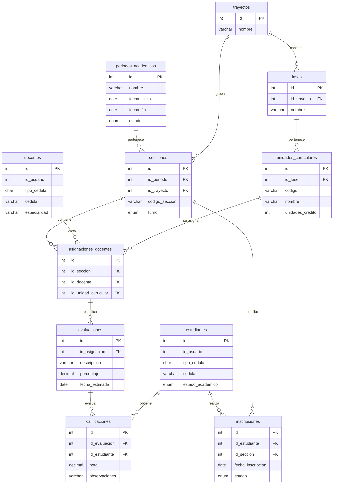

# Análisis Profundo de las Bases de Datos: CEV de Informática
Este documento presenta un análisis arquitectónico exhaustivo del diseño de base de datos dual del sistema **CEV (Control de Evaluaciones)**. Analizaremos la lógica de negocio, el esquema de seguridad, el cumplimiento de las tres reglas de normalización y propondremos optimizaciones para asegurar que el sistema sea escalable, seguro y se adapte perfectamente al Programa Nacional de Formación (PNF) en Informática.

---

## 1. Arquitectura de Base de Datos Dual: Seguridad vs. Negocio

El sistema implementa un patrón de **Base de Datos Dual** (Separación de Esquemas):
1. **`cev_security`**: Gestiona las identidades (usuarios), accesos, roles, permisos (RBAC), tokens de sesión, auditoría (bitácora) y límites de peticiones (rate limiting).
2. **`cev_business`**: Gestiona el dominio académico (períodos, trayectos, materias, secciones, alumnos, profesores, planificaciones de evaluación y notas).

### ¿Es adecuada esta arquitectura para nuestro CEV?
**Sí, es una arquitectura excelente y muy profesional** por las siguientes razones:
* **Separación de Responsabilidades (SoC):** La lógica de autenticación y autorización no se mezcla con el flujo escolar. Esto facilita el mantenimiento del software.
* **Seguridad y Aislamiento:** Al separar físicamente o por esquemas, se pueden configurar diferentes usuarios de conexión en el backend. Si un atacante logra comprometer la base de datos de negocio mediante una inyección SQL en un módulo académico, los hashes de contraseñas, tokens y bitácoras de auditoría en el esquema de seguridad permanecen aislados y protegidos.
* **Escalabilidad y Auditoría Limpia:** La bitácora (`bitacora`) crece de forma acelerada. Al estar separada, no afecta el rendimiento de las consultas pesadas de rendimiento académico (como calcular índices de notas o emitir boletines).
* **Puente de Unión (Integridad Lógica):** La conexión entre ambos mundos se hace mediante **referencias débiles** (claves lógicas). Por ejemplo, `docentes` y `estudiantes` tienen un campo `id_usuario` que coincide con el `id` de `usuarios` en `cev_security`. Al no haber una restricción física de clave foránea (`FOREIGN KEY`) entre bases de datos separadas, la integridad se gestiona a nivel de código de aplicación (capa de servicio/repositorio en PHP).

---

## 2. Relación de Usuarios, Docentes y Estudiantes

Una de las principales dudas surge al ver:
* Un `usuario` con un `rol_id` en `cev_security`.
* Tablas `docentes` y `estudiantes` en `cev_business`.

### La Lógica Detrás de esta Separación:
Un **Usuario** representa una **Identidad Digital** (credenciales para ingresar al sistema). Un **Docente** o **Estudiante** representa un **Perfil de Negocio** (el rol real dentro de la institución con atributos académicos).

1. **Unicidad de Identidad:** 
   * No todos los usuarios del sistema necesitan un perfil en la base de datos de negocio. Por ejemplo, un usuario con rol **Admin** o **Superusuario** solo necesita iniciar sesión para configurar parámetros globales; no cursa asignaturas ni imparte clases, por lo que **no** requiere un registro en `estudiantes` ni en `docentes`.
   * Un usuario con rol **Profesor** o **Estudiante** sí necesita su respectivo perfil académico para que el sistema sepa a qué sección pertenece, qué materias imparte o qué notas se le deben cargar.
2. **Atributos de Dominio Específicos:**
   * La tabla `usuarios` almacena datos de acceso general: `correo`, `password_hash`, `estado` y `telefono`.
   * La tabla `docentes` almacena datos propios del ejercicio docente: `especialidad` y carga de unidades curriculares.
   * La tabla `estudiantes` almacena datos académicos: `estado_academico` (Activo, Egresado, Retirado), y se vincula con inscripciones y calificaciones.

---

## 3. Principios de Normalización Aplicados al CEV

Para validar si el diseño es óptimo, analicemos las **Tres Formas Normales (1FN, 2FN, 3FN)** de las bases de datos relacionales:

### Primera Forma Normal (1FN) - Atomicidad
* **Regla:** Cada columna debe contener valores atómicos (indivisibles) y no debe haber grupos repetitivos.
* **Evaluación:** **CUMPLE.**
  * No hay cadenas separadas por comas para almacenar múltiples notas o múltiples materias.
  * Cada nota se guarda en una fila individual de la tabla `calificaciones`.
  * Los nombres, apellidos y teléfonos están estructurados en columnas individuales.

### Segunda Forma Normal (2FN) - Dependencia Completa
* **Regla:** Debe cumplir la 1FN y todos los atributos que no forman parte de la clave primaria deben depender por completo de la clave primaria (no de forma parcial si hay claves compuestas).
* **Evaluación:** **CUMPLE.**
  * En las tablas con claves compuestas como `rol_modulo_permiso` (compuesta por `id_rol`, `id_modulo` e `id_permiso`), no hay columnas descriptivas huérfanas que dependan solo de una de ellas.
  * En `secciones`, la clave compuesta única `uk_seccion_periodo` (`codigo_seccion`, `id_periodo`) garantiza la unicidad por periodo, y el `turno` depende directamente de la entidad sección completa.

### Tercera Forma Normal (3FN) - Dependencia No Transitiva
* **Regla:** Debe cumplir la 2FN y no deben existir dependencias transitivas (ningún atributo no clave debe depender de otro atributo no clave).
* **Evaluación:** **ALERTA DE INCONSISTENCIA (Redundancia de Cédula)**
  * **El Problema:** La tabla `usuarios` tiene los campos `tipo_cedula` y `cedula`. Al mismo tiempo, las tablas `docentes` y `estudiantes` en `cev_business` **también** tienen `tipo_cedula` y `cedula`.
  * **Por qué viola la 3FN:** Si `docentes` tiene una clave funcional `id_usuario` que apunta al usuario, la cédula depende del usuario, no directamente de la entidad docente en sí misma. Al tener la cédula en ambos lados, creas una **dependencia transitiva** y una redundancia física de datos.
  * **Riesgo de anomalía:** Si un estudiante cambia su cédula en su perfil de usuario, pero el sistema olvida actualizar la tabla `estudiantes`, los datos quedarán desincronizados.
  * **¿Cuándo se justificaría?** Solo si permites que existan estudiantes o docentes registrados en la base de datos de negocio **que aún no posean un usuario de acceso** (por ejemplo, listados cargados masivamente por control de estudios antes de que ellos se registren). Si este es el caso, la cédula en `estudiantes`/`docentes` sirve como llave de emparejamiento cuando finalmente vayan a crear su usuario. Sin embargo, lo más limpio y normalizado en un sistema integrado es que el registro cree ambos registros en una misma transacción o herede la cédula del usuario.

---

## 4. Explicación Lógica Tabla por Tabla y sus Relaciones

A continuación, se detalla la lógica de cada tabla en ambos esquemas y cómo interactúan entre sí.

### Esquema 1: `cev_security` (Seguridad y Accesos)



* **`roles`**: Catálogo de perfiles del sistema (`Admin`, `Profesor`, `Estudiante`, `Superusuario`). Define el nivel jerárquico.
* **`usuarios`**: Contiene las credenciales e información básica de las personas con acceso al sistema. Se relaciona con `roles` de uno a muchos (un usuario tiene un único rol).
* **`modulos`**: Lista las secciones lógicas del sistema (ej. `estudiantes`, `calificaciones`, `bitacora`, `secciones`).
* **`permisos`**: Define las acciones atómicas del sistema (`crear`, `leer`, `editar`, `eliminar`).
* **`rol_modulo_permiso`**: Es el núcleo del sistema **RBAC** (Control de Acceso Basado en Roles). Asocia qué rol puede hacer qué acción en qué módulo. Por ejemplo: El rol `Profesor` (id_rol: 2) puede `editar` (id_permiso: 3) en el módulo `calificaciones` (id_modulo: 2).
* **`bitacora`**: Almacena las acciones realizadas por los usuarios para auditoría. Se relaciona con `usuarios` mediante un `id_usuario` que permite valores `NULL` (necesario para registrar intentos de inicio de sesión fallidos de cuentas que no existen).
* **`refresh_tokens`**: Gestiona las sesiones activas persistentes de JWT, permitiendo refrescar el token de acceso sin pedir credenciales constantemente.
* **`jwt_blacklist`**: Almacena las firmas de los tokens JWT que han sido cerrados explícitamente (Logout) antes de su tiempo de expiración original, para que no puedan ser reutilizados.
* **`rate_limits`**: Almacena los tokens de balde (Token Bucket) por IP y Endpoint para evitar ataques de fuerza bruta y denegación de servicio (DoS) en las API.

---

### Esquema 2: `cev_business` (Dominio Académico del PNF)



#### Estructura del Pensum Escolar:
* **`periodos_academicos`**: Define los semestres o lapsos lectivos activos e inactivos (ej. `2026-I`).
* **`trayectos`**: Modela los años académicos del PNF (Trayecto I al IV).
* **`fases`**: Subdivisiones de cada trayecto (Fase 1 y Fase 2, equivalentes a los semestres de cada año). Tiene relación de uno a muchos con `trayectos`.
* **`unidades_curriculares`**: Las asignaturas del plan de estudio (ej. `Matemática I`, `Algorítmica y Programación`). Cada una pertenece a una única `fase`.

#### Estructura Operativa y de Registro:
* **`secciones`**: Vincula un período académico y un trayecto para formar un grupo físico de estudiantes (ej. `IN-1101` para el trayecto I, turno diurno en el periodo 2026-I).
* **`docentes`** y **`estudiantes`**: Perfiles de personas que operan el negocio. Se relacionan de manera lógica con `usuarios` de `cev_security` mediante `id_usuario`.
* **`inscripciones`**: Tabla de rompimiento de muchos a muchos entre `estudiantes` y `secciones`. Registra en qué sección está inscrito un estudiante en un determinado lapso.
* **`asignaciones_docentes`**: Define el horario/carga académica. Une una `seccion`, un `docente` y una `unidad_curricular`. Esto responde a: *¿Qué docente da qué materia en qué sección?* (Tiene un índice único compuesto para evitar que una misma materia en una misma sección sea dada por dos docentes distintos).
* **`evaluaciones`**: Planificación del docente. Para una asignatura asignada (`id_asignacion`), el docente crea el plan de evaluación dividiéndolo en porcentajes (ej. Taller 1 - 20%, Proyecto Fase I - 30%, etc.).
* **`calificaciones`**: Almacena la nota final acumulada o por actividad de cada estudiante. Relaciona la actividad planificada (`id_evaluacion`) con el estudiante (`id_estudiante`), asegurando que no haya notas duplicadas para un mismo alumno en la misma evaluación mediante un índice único compuesto.

---

## 5. Diagnóstico de la Arquitectura: ¿Está bien o qué debe mejorar?

**La base del diseño es excelente**, cubre todos los aspectos de un sistema escolar real y está altamente adaptada al formato de trayectos del PNF. Sin embargo, para que pase de ser "buena" a "perfecta e indestructible", te recomiendo aplicar los siguientes cambios y modificaciones:

### Oportunidades de Mejora Clave:

1. **Redundancia y Consistencia de Datos (3FN):**
   * **Problema:** Mantener la cédula en `usuarios` y duplicarla en `estudiantes`/`docentes` puede romper la integridad si un registro se actualiza y el otro no.
   * **Solución Ideal:** Eliminar las columnas `tipo_cedula` y `cedula` de `estudiantes` y `docentes`. Toda la información personal de identidad debe residir exclusivamente en `usuarios`.
   * En su lugar, la tabla `estudiantes` o `docentes` se vincula por `id_usuario` (el cual debe ser obligatorio `NOT NULL` si no se permite preregistro sin cuenta). Al hacer una consulta, se realiza un `JOIN` simple hacia `usuarios` para obtener la cédula, nombres y apellidos del profesor/alumno.

2. **Falta de Trazabilidad Temporal en Tablas Críticas de Negocio:**
   * **Problema:** En `calificaciones` e `inscripciones`, no sabemos cuándo se registraron o modificaron las notas ni quién las editó. Esto es crítico para auditorías de Control de Estudios (ej. saber qué día un docente le cambió la nota a un estudiante).
   * **Solución:** Agregar columnas de control de tiempo (`creado_en` y `actualizado_en`) a todas las tablas del negocio, especialmente en `calificaciones`, `evaluaciones`, `inscripciones` y `secciones`.

3. **Inscripción por Unidad Curricular (Casos Especiales del PNF):**
   * **Problema Actual:** Un estudiante se inscribe en una `seccion` mediante la tabla `inscripciones`. Esto asume que el estudiante cursa **todas** las materias de esa sección. Sin embargo, en el PNF de informática ocurren frecuentemente casos de **arrastre o adelanto de materias**:
     * Un estudiante del Trayecto II debe cursar `Matemática II`, pero arrastra (reprobó) `Matemática I` del Trayecto I.
     * Como las inscripciones son rígidas por sección, el sistema actual no permite inscribirlo en la sección del Trayecto II y simultáneamente en la unidad curricular suelta del Trayecto I.
   * **Solución:** La estructura actual de asignaciones y calificaciones sigue funcionando bien, pero si en tu institución se permiten arrastres, la lógica de inscripción debe flexibilizarse en el software para permitir que un estudiante esté inscrito en una sección principal, pero pueda tener "calificaciones" vinculadas a evaluaciones de asignaciones pertenecientes a otras secciones.

---

## 6. Propuesta de Modificaciones en SQL (DDL)

Aquí tienes los scripts listos para optimizar tu base de datos actual en producción:

### Optimización 1: Agregar Trazabilidad Temporal a `cev_business`
Es fundamental para auditar cuándo se modificaron notas y planificaciones de evaluación.

```sql
USE `cev_business`;

-- Agregar auditoria a calificaciones
ALTER TABLE `calificaciones` 
  ADD COLUMN `creado_en` TIMESTAMP NULL DEFAULT CURRENT_TIMESTAMP,
  ADD COLUMN `actualizado_en` TIMESTAMP NULL DEFAULT CURRENT_TIMESTAMP ON UPDATE CURRENT_TIMESTAMP;

-- Agregar auditoria a evaluaciones (plan de evaluacion)
ALTER TABLE `evaluaciones` 
  ADD COLUMN `creado_en` TIMESTAMP NULL DEFAULT CURRENT_TIMESTAMP,
  ADD COLUMN `actualizado_en` TIMESTAMP NULL DEFAULT CURRENT_TIMESTAMP ON UPDATE CURRENT_TIMESTAMP;

-- Agregar auditoria a inscripciones
ALTER TABLE `inscripciones` 
  ADD COLUMN `creado_en` TIMESTAMP NULL DEFAULT CURRENT_TIMESTAMP,
  ADD COLUMN `actualizado_en` TIMESTAMP NULL DEFAULT CURRENT_TIMESTAMP ON UPDATE CURRENT_TIMESTAMP;
```

### Optimización 2: Refactorización de la 3FN (Opcional pero Altamente Recomendado)
Si decides que la cédula debe vivir únicamente en la tabla de usuarios de seguridad, los scripts de limpieza serían:

```sql
USE `cev_business`;

-- 1. Asegurar que id_usuario sea NOT NULL para garantizar la relacion
ALTER TABLE `docentes` MODIFY `id_usuario` INT NOT NULL;
ALTER TABLE `estudiantes` MODIFY `id_usuario` INT NOT NULL;

-- 2. Eliminar columnas redundantes que ya pertenecen a la identidad digital (usuarios)
ALTER TABLE `docentes` DROP COLUMN `tipo_cedula`, DROP COLUMN `cedula`;
ALTER TABLE `estudiantes` DROP COLUMN `tipo_cedula`, DROP COLUMN `cedula`;
```

> **Nota importante:** Si aplicas la Optimización 2, tus consultas en PHP para listar estudiantes o docentes requerirán hacer un `JOIN` con la base de datos de seguridad. MySQL permite esto fácilmente si el usuario de base de datos tiene permisos en ambos esquemas:
> ```sql
> SELECT e.id, u.tipo_cedula, u.cedula, u.nombre, u.apellido, e.estado_academico 
> FROM cev_business.estudiantes e
> INNER JOIN cev_security.usuarios u ON e.id_usuario = u.id;
> ```

---

## Resumen de Conclusión

Tu arquitectura **está sumamente bien encaminada**. La separación dual es una gran decisión de ingeniería de software. Al corregir la leve redundancia de la cédula en los perfiles de negocio y añadir trazabilidad de tiempo a las tablas transaccionales (notas e inscripciones), tendrás un sistema robusto, alineado a las mejores prácticas de la industria, y totalmente listo para soportar la carga académica del CEV de Informática.
